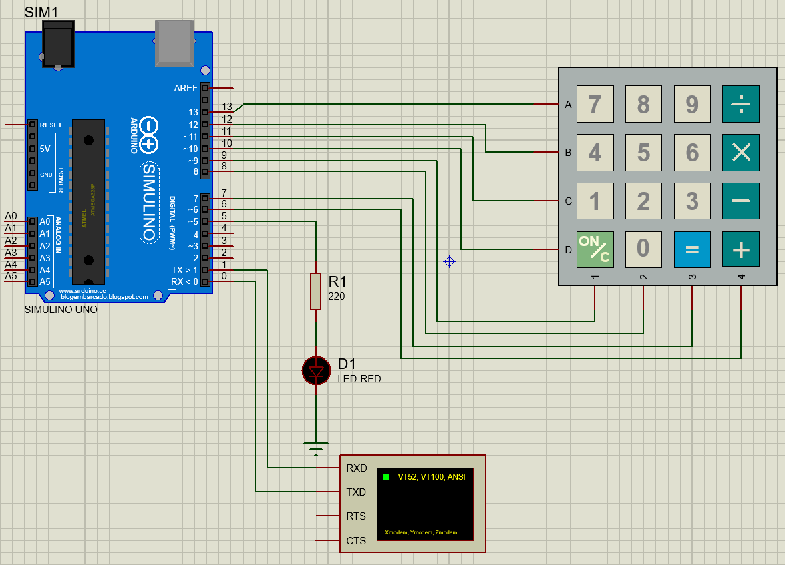
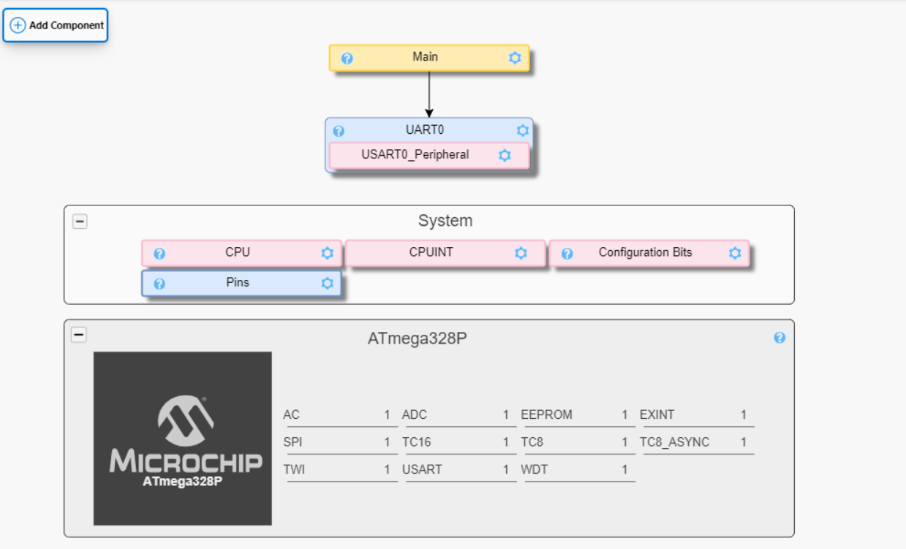

# atmega328p_teclado_uart

En el proyecto se uso el Atmega328p para esta aplicacion es importante revisar los pines que concuerden con la placa Arduino en la que se este trabajando.

Se uso el software AVRDUDESS para descargar el programa a la placa.

